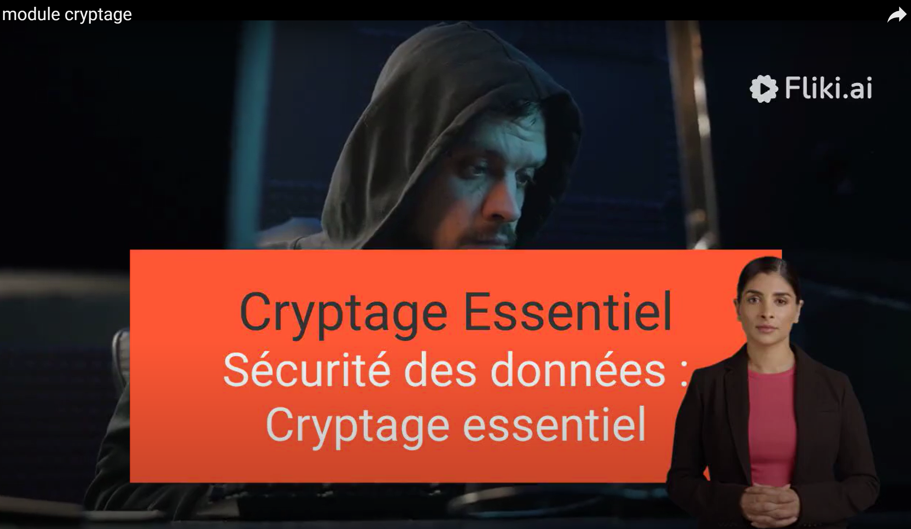

## Appel d'offres pour le développement d'une solution de cryptage de documents

  
  
<em>Vidéo : Cahier des charges</em>

## 1. Objet

Le présent  document est un appel d'offres, il a pour objet la sélection d'un prestataire en vu de répondre aux besoins de  notre entreprise leader dans le marché du numérique.

## 2. Besoins
Les besoins sont décrits dans la  [vidéo](https://youtu.be/a0vRj8_Lh-8?si=V7ermoXHiJJivlfH)
.

### Fonctionnalités du logiciel de cryptage

**Simplicité d'utilisation**: Le cryptage et le décryptage des documents doivent être simples et rapides pour les utilisateurs, par exemple via une interface web permettant l'accès à celui-ci.

**Sécurité**: La solution doit permettre de garantir un  niveau de sécurité élèvé pour les documents cryptés, l'algorithme de cryptage doit être de type symétrique, pensé par l'équipe de projet.

**Portabilité**: Développer une solution logicielle multiplateforme qui fonctionne sur tous les systèmes d'exploitation sans nécessiter d'installation supplémentaire, permettant une exécution directe à partir de l'exécutable.

**Confidentialité**: La solution doit garantir la confidentialité des documents cryptés.

### Formation au gestionnaire de mots de passe

**Présentation**: Une présentation orale de démonstration de l'outil `Keepass` sera proposée (durée 5 minutes maximum).

**Documentation**: Une notice d'utilisation sera rédigée (1 page recto verso maximum) ainsi qu'une vidéo (3 minutes maximum)

## 3. Déroulement de l'appel d'offres

### 3.1. Phase de remise des offres

Les candidats intéressés par cet appel d'offres devront remettre un dossier de candidature sous 2 jours comprenant les éléments suivants :
 
* Un `proposition tarifaire` 
* Une `planification` du développement et du déploiement de la solution.
* La solution de cryptage retenue.
* Présentation de l'IHM (Figma).

### 3.2. Phase d'audition

Les candidats dont les dossiers de candidature auront été retenus seront auditionnés par un comité de sélection. Cette audition permettra de présenter la solution proposée en détail et de répondre aux questions du comité de sélection.

### 3.3. Décision

Le comité de sélection sélectionnera le prestataire sur la base des critères suivants :

* La qualité de la solution proposée.
* Le niveau de sécurité garanti.
* La simplicité d'utilisation.
* Le prix.

## 4. Calendrier
1. Remise des offres: `une semaine aprés la parution de l'appel d'offres.`

2. Audition des candidats: `semaine suivante.`

3. Notification du prestataire sélectionné: `dernier jour ouvré de la semaine d'audition.`

## 5. Contact

Pour toute information relative à cet appel d'offres, veuillez contacter :

1. Fonction: Dirigeant
    * Nom: Mohamed TOBJI
    * Email: dirigeant.ciel@lycee-jeanrostand.fr
2. Fonction: Équipe commerciale
    * Nom: Mohamed MADANI
    * Email: commercial.ciel@lycee-jeanrostand.fr
3. Fonction: Équipe technique
    * Nom: Djamel BENNOUR
    * Email: technique.ciel@lycee-jeanrostand.fr

